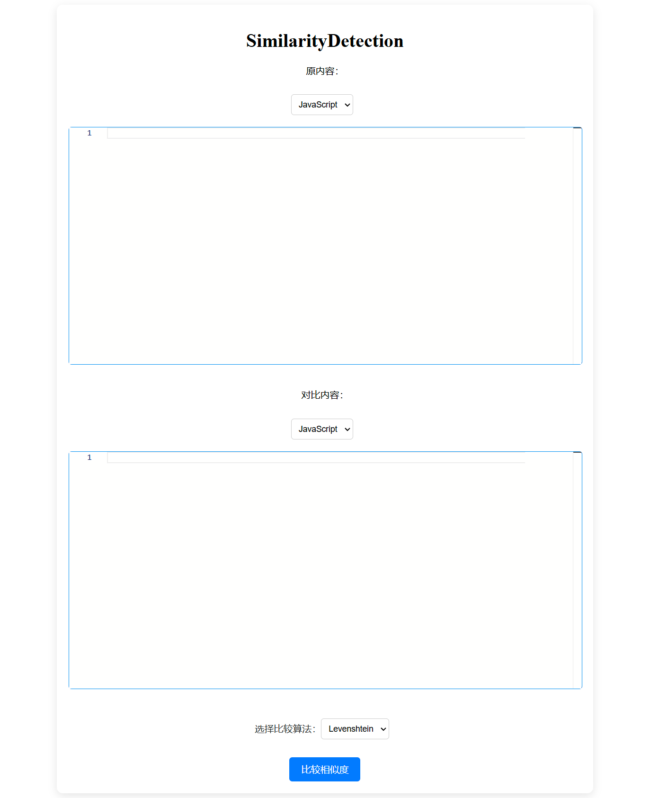

# 🌟 **SimilarityDetection** 🌟

A simple **code similarity detection tool** that allows you to compare and analyze code snippets for similarities using advanced algorithms.

---

## 🚀 **Technologies Used**

### Frontend:
- **Vue.js** - A progressive JavaScript framework for building user interfaces.

### Backend:
- **Spring Boot** - A Java framework to create stand-alone, production-grade Spring-based applications.

---

## 📸 **Preview**



---

## ⚙️ **How to Deploy the Web Application**

To deploy the web application locally, follow these steps:

1. **Install Frontend Dependencies**:

    Run the following command in the frontend directory to install necessary dependencies:

    ```bash
    npm install
    ```

2. **Run the Vue Development Server**:

    After the dependencies are installed, you can start the frontend server:

    ```bash
    npm run serve
    ```

    This will start the Vue.js development server on your local machine.

3. **Build the Backend (Spring Boot)**:

    Now, move to the backend directory and build the Spring Boot application:

    ```bash
    mvn clean package
    ```

4. **Run the Spring Boot Application**:

    Once the application is built, you can run the backend server with the following command:

    ```bash
    mvn spring-boot:run
    ```

    Your backend server will now be running on your local machine!

---

## 🐍 **How to Use the Python Frontend Script**

To use the Python frontend script, follow the steps below:

1. **Ensure Python Dependencies Are Installed**:

    Install necessary Python packages using pip:

    ```bash
    pip install -r requirements.txt
    ```

2. **Run the Python Script**:

    Execute the script to start the code similarity detection process:

    ```bash
    python frontend_script.py
    ```

---

## 📄 **Contributing**

Feel free to fork the repository, make changes, and create pull requests to improve this tool! We'd love to accept contributions from the community. 💻

---

## 📧 **Contact**

If you have any questions or feedback, feel free to reach out to us!

---

### Enjoy using **SimilarityDetection**! 🔍💡
